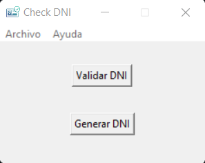
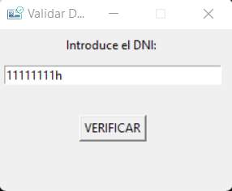
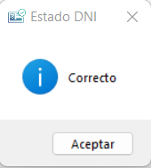
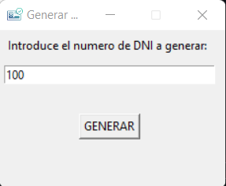
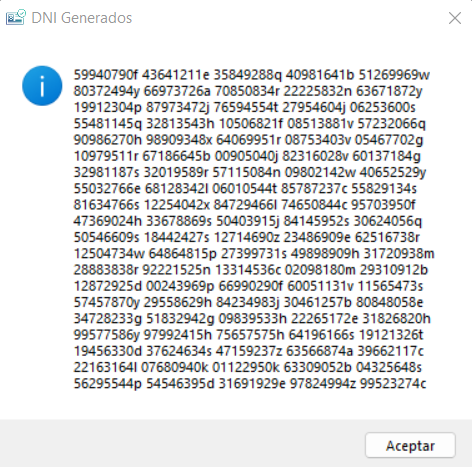

# checkDNI

Programa validador de DNI

## Opciones

El programa tiene dos opciones principales:

* Validar numeros de dni

* Generar numeros de dni validos

**Validar un numero de dni:**

1- Pulsaremos en Validar DNI, se nos abrira la siguiente ventana donde introduciremos el dni a validar

2- Pulsaremos en VALIDAR y nos dira si el DNI es Correcto o Incorrecto

**Generar numeros de dni aleatorios**

1- Pulsaremos en Generar DNI, se nos abrira la ventanta en la que introduciremos el numero de dnis a generar de forma aleatoria.
En estos momentos se pueden generar de 1 a 5000

2- Pulsaremos en GENERAR y nos mostrara los numeros generados, en estos momentos el programa no permite copiar 
los numeros generados mediante el raton, ni teclado

### Sistemas Operativos Soportados

Requiere Python 3.10 o superior instalado en los Sistemas Operativos compatibles

- Windows 10

- Windows 11